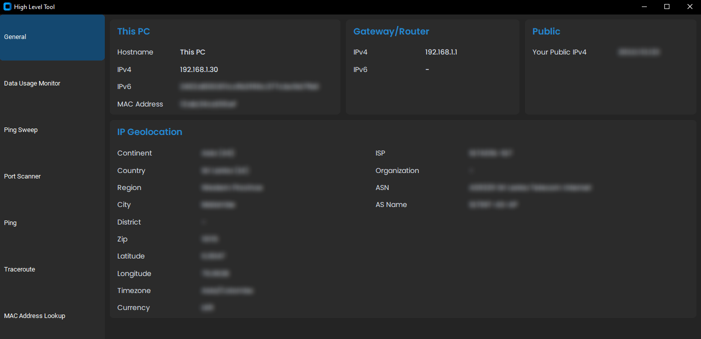
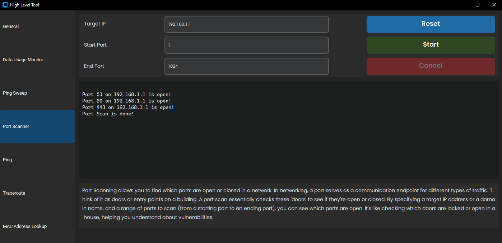
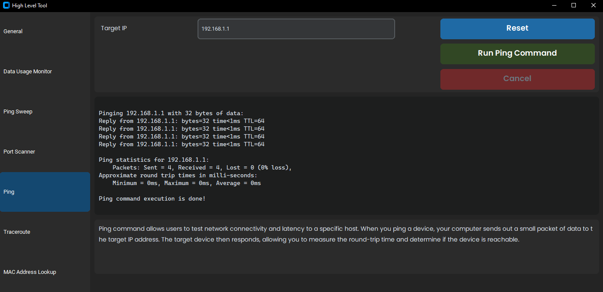

## A High Level Tool for Computer Networking Tasks

This is the tool i build for my final year project module.

The goal of this tool is to provide a GUI that abstracts some basic networking functionalities, allowing users who are not familiar with network related terms and tools to utilize them without having to worry about navigating the CLI, as most networking tools require a CLI to use them.

### Some screenshots of the tool 🔍

#

### Links 🔗

- Download: https://github.com/DarkstarXDD/high-level-tool/releases/

#

### Features 🎉

- Display some general network related data of the user's system.
- Display some geolocation data based on user's public IP.
- Monitor data usage of the system (Upload & Download)
- Perform a ping sweep & a port scan.
- Execute ping & traceroute commands using the GUI.
- Perform a MAC address lookup.

#

### Built with 🔧🔨

- Python 3.12.
- `customtkinter` as the UI library.
- `pyinstaller` to convert the program to an installable .exe file.
- `requests` for API calls.
- `psutils` for data usage monitor.
- `socket` for port scanning.
- `scapy` for ping sweep.
- `subprocess` to execute windows commands.
- `threading` to speed up some tasks and to make sure the GUI didn't freeze when running scans.
